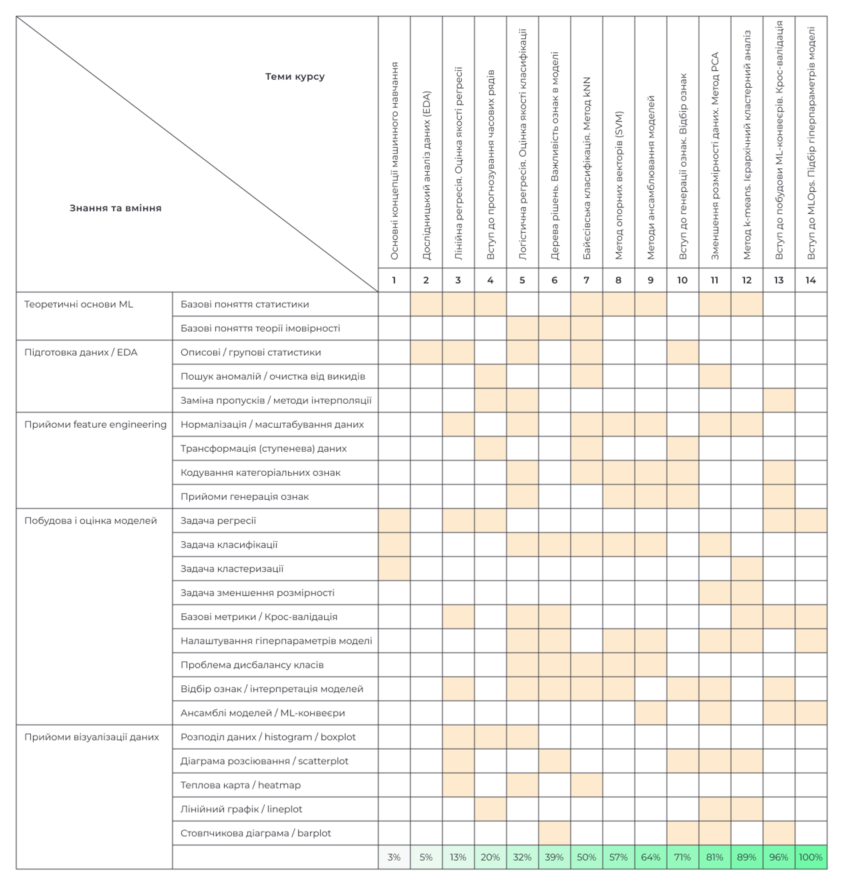

# Machine Learning: Fundamentals and Applications

## Про курс
Цей курс — частина програми EU магістратури Neoversity, спеціалізація Data Science & Data Analytics.  
</br>
Ознайомитись з повною магістерською програмою Data Science & Data Analytics та дізнатись більше про онлайн-навчання для IT-фахівців можна [тут](https://i.goit.global/Juqlh).

## Автор курсу
Володимир Голомб : : [LinkedIn](https://www.linkedin.com/in/vholomb) : : [Medium](https://medium.com/@wldmrgml) : : [GitHub](https://github.com/woldemarg)

## Зміст курсу
125 годин, 14 занять, 8 тижнів, 5 практичних ДЗ, 2 дослідницьких ДЗ, 1 фінальний проєкт (у форматі Kaggle змагання).
</br>
| **#** | **Модуль / Тиждень** | **#** | **Тема** | **URL** |
|:---:|---|:---:|---|:---:|
| 1 | **Машинне навчання і аналіз даних** | 1 | Основні концепції машинного навчання |  |
|  |  | 2 | Дослідницький аналіз даних (EDA) | [практика](notebooks/mod_01_topic_02_pandas_eda.ipynb) |
| 2 | **Алгоритми навчання з вчителем Ч.1** | 3 | Лінійна регресія. Оцінка якості регресії | [практика](notebooks/mod_02_topic_03_linear_regression.ipynb) |
|  |  | 4 | Вступ до прогнозування часових рядів | [практика](notebooks/mod_02_topic_04_time_series.ipynb) |
| 3 | **Алгоритми навчання з вчителем Ч.2** | 5 | Логістична регресія. Оцінка якості класифікації | [практика](notebooks/mod_03_topic_05_logistic_regression.ipynb) |
|  |  | 6 | Дерева рішень. Важливість ознак в моделі | [практика](notebooks/mod_03_topic_06_decision_tree.ipynb) |
| 4 | **Алгоритми навчання з вчителем Ч.3** | 7 | Байєсівська класифікація. Метод kNN | [практика](notebooks/mod_04_topic_07_bayes_knn.ipynb) |
|  |  | 8 | Метод опорних векторів (SVM) | [практика](notebooks/mod_04_topic_08_svm.ipynb) |
| 5 | **Підходи до покращення якості** | 9 | Методи ансамблювання моделей | [практика](notebooks/mod_05_topic_09_ensembles.ipynb) |
|  |  | 10 | Вступ до генерації ознак. Відбір ознак | [практика](notebooks/mod_05_topic_10_feature_engineering.ipynb) |
| 6 | **Алгоритми навчання без вчителя** | 11 | Зменшення розмірності даних. Метод PCA | [практика](notebooks/mod_06_topic_11_pca.ipynb) |
|  |  | 12 | Метод k-means. Ієрархічний кластерний аналіз | [практика](notebooks/mod_06_topic_12_kmeans.ipynb) |
| 7 | **Організація потоку робочих процесів** | 13 | Вступ до побудови ML-конвеєрів. Крос-валідація | [практика](notebooks/mod_07_topic_13_mlpipe.ipynb) |
|  |  | 14 | Вступ до MLOps. Підбір гіперпараметрів моделі | [практика](notebooks/mod_07_topic_14_mlflow.ipynb) |

## Матриця знань/навичок


## Налаштування середовища
```sh
# Python Version: 3.11.9
conda env create -f requirements_conda.yml
# alternative
# pip install -r requirements_pip.txt
```